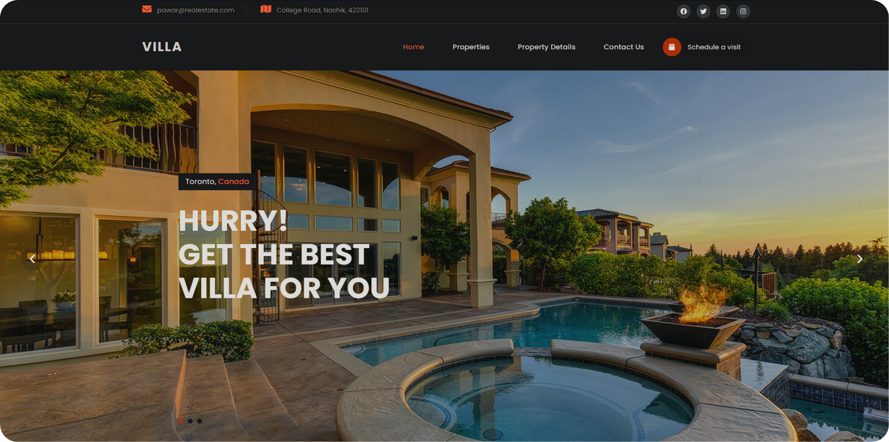

# Real Estate Platform - [Live](https://real-estate-pawar.netlify.app/)

Welcome to the Real Estate Platform project! This repository contains the code for my React-based web application.

## About the Project

The Real Estate Platform is designed to streamline property searches and showcase listings effectively. It offers users an intuitive interface to explore available properties with ease.

## Screenshot



## Features

- **🏠 Property Listings**: View detailed information about properties, including price, location, and features.
- **🔍 Advanced Search**: Filter properties based on criteria such as price range, location, and type.
- **📱 Mobile-Friendly**: Fully responsive design ensures a seamless experience on any device.
- **⚡ Fast and Reliable**: Built with React for a smooth user experience and optimized performance.

## Technologies Used

- **Frontend**: React, Tailwind CSS
- **Hosting**: Netlify

## How to Use

1. Clone this repository:
   ```bash
   git clone https://github.com/Prathmeshpawar21/web-real-estate.git
   ```
2. Navigate to the project directory:
   ```bash
   cd web-real-estate
   ```

## Deployment

This platform is hosted on Netlify. To deploy:
1. Link the repository to your Netlify account.
2. Push changes to the `main` branch, and Netlify will automatically deploy the updates.

---

Thank you for exploring my Real Estate Platform! If you find this project helpful, please give it a ⭐ to show your support.
